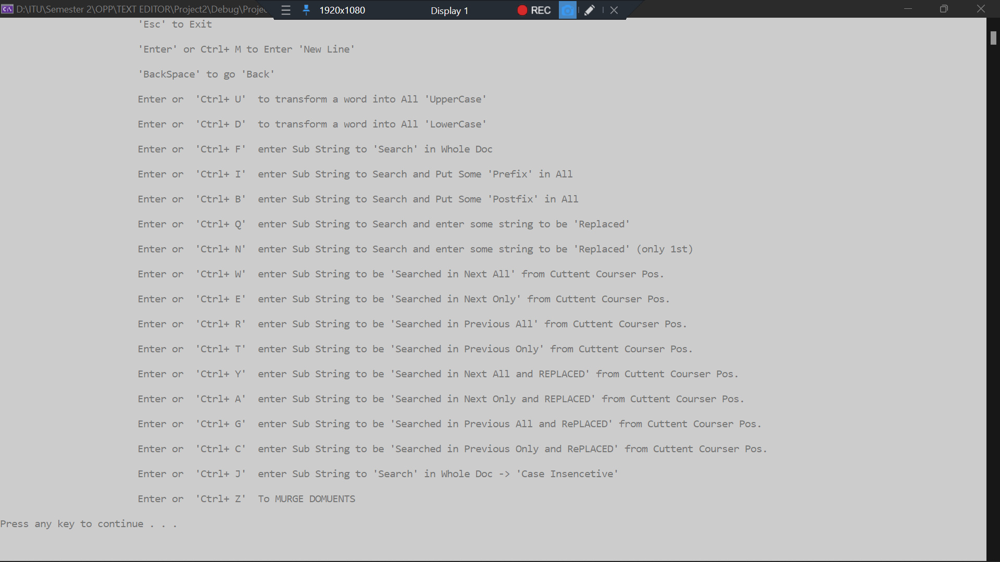

# Ultimate Text Editor

A console base C++ text editor developed in OOP's paradime.

## Features 
- File Manager (keep track of all created, exisiting files)
- Auto Save Enable/Disable
- Poassword Protected Files (can set/unset password of any file)
- New file creation, Editing previously esxiting files
- Apending two files
- Free cursore movement (to nevigate to any line of the file)
- Keep track of Real time: 
 -- Averge Word Length
 -- Special Charters
 -- Word Count
 -- small words
 -- large words
 -- num of sentences
 -- number of paragrphs
- Many **Short Keys** avliable, Ctrl+L to open Short Keys menu

### Short Keys:
    -  'Esc' to Exit
	-	'Enter' or Ctrl+ M to Enter 'New Line'
	-	'BackSpace' to go 'Back'
	-	Enter or  'Ctrl+ U'  to transform a word into All 'UpperCase'
	-	Enter or  'Ctrl+ D'  to transform a word into All 'LowerCase'
	-	Enter or  'Ctrl+ F'  enter Sub String to 'Search' in Whole Doc
	-	Enter or  'Ctrl+ I'  enter Sub String to Search and Put Some 'Prefix' in All
	-	Enter or  'Ctrl+ B'  enter Sub String to Search and Put Some 'Postfix' in All
	-	Enter or  'Ctrl+ Q'  enter Sub String to Search and enter some string to be 'Replaced'
	-	Enter or  'Ctrl+ N'  enter Sub String to Search and enter some string to be 'Replaced' (only 1st)
	-	Enter or  'Ctrl+ W'  enter Sub String to be 'Searched in Next All' from Cuttent Courser Pos. 
	-	Enter or  'Ctrl+ E'  enter Sub String to be 'Searched in Next Only' from Cuttent Courser Pos. 
	-	Enter or  'Ctrl+ R'  enter Sub String to be 'Searched in Previous All' from Cuttent Courser Pos. 
	-	Enter or  'Ctrl+ T'  enter Sub String to be 'Searched in Previous Only' from Cuttent Courser Pos.
	-	Enter or  'Ctrl+ Y'  enter Sub String to be 'Searched in Next All and REPLACED' from Cuttent Courser Pos.
	-	Enter or  'Ctrl+ A'  enter Sub String to be 'Searched in Next Only and REPLACED' from Cuttent Courser Pos.
	-	Enter or  'Ctrl+ G'  enter Sub String to be 'Searched in Previous All and RePLACED' from Cuttent Courser Pos.
	-	Enter or  'Ctrl+ C'  enter Sub String to be 'Searched in Previous Only and RePLACED' from Cuttent Courser Pos.
	-	Enter or  'Ctrl+ J'  enter Sub String to 'Search' in Whole Doc -> 'Case Insencetive'
	-	Enter or  'Ctrl+ Z'  To MURGE DOMUENTS;

## Samples

### File Manager

### Editor

### Short Keys

